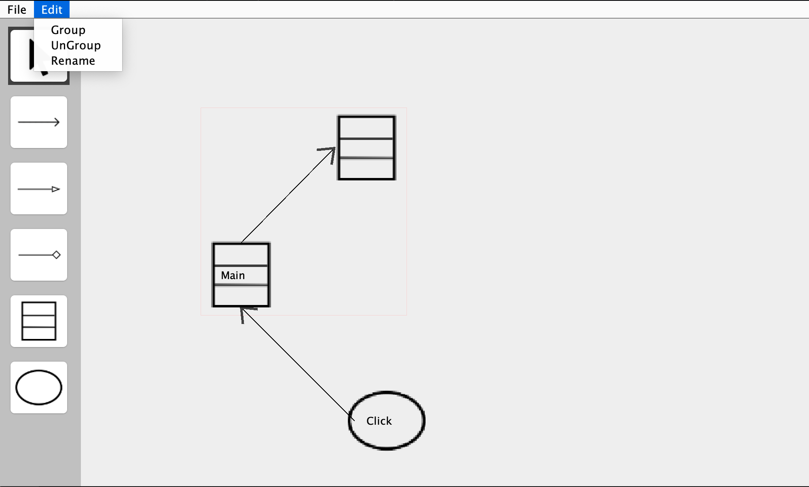

# OO UML Editor

## Screenshots

## About

This is the term project of the course **Object-Oriented Analysis and Design** (2021, National Central University).

## Feature

This is a simple UML editor with:

- Objects
  - Class
  - Use Case

- Relation Lines
  - Association Line
  - Generation Line
  - Composition Line

- Behavior
  - Create a new object
  - Rename an object
  - Drag an object
  - Connect between objects
  - Replace the connections between objects
  - Group objects
  - UnGroup objects

For detailed spec, [see this file](resource/uml-spec.pdf).